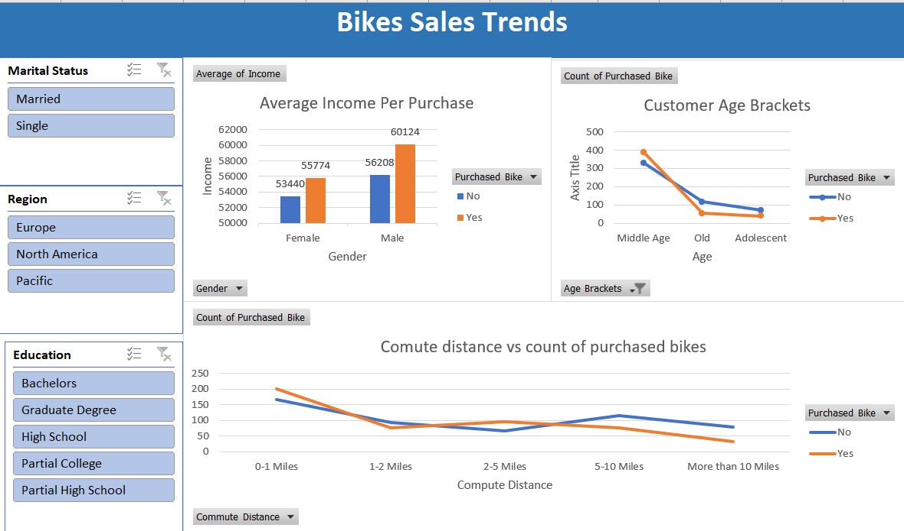

## Bike sales analysis 

This project examines sales data related to bicycles and analyzing various factors that can impact sales performance. This analysis provides insights into customer preferences, market trends, and sales performance, and can help organizations optimize their sales strategies, identify growth opportunities, and make data-driven decisions. 

